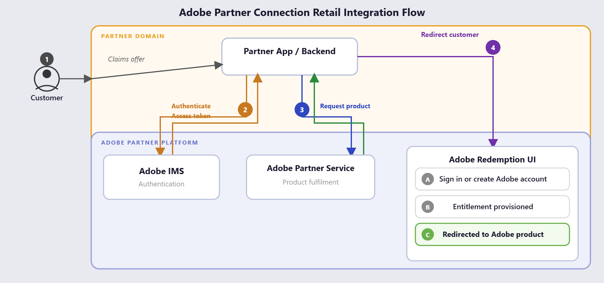

# Overview

Adobe Partner Retail supports several consumer-facing distribution channels, unified by a common partner integration model and a consistent provisioning experience. The channels differ mainly in how the offer reaches the consumer; once a customer claims an offer, the experience of signing in, providing consent, and gaining access to Adobe products remains consistent across all channels.

| Channel | Description |
|---|---|
| Telecom | Telecommunications operators bundle Adobe into mobile or broadband plans, carried on the customer's regular invoice. The partner initiates the offer, and the customer signs in and is provisioned with Adobe. |
| OEM | Offers that come with a new device, pre-loaded or presented at first setup. Follows the same claim and provision experience as other partner-led channels. |
| Affinity | Adobe products are offered as a membership or loyalty benefit through brands, financial institutions, and associations, using the same shared claim and provisioning flow. |

## Key value propositions

Partners can currently initiate a product claim on behalf of a customer using the `Product Claim API`, which returns an `experience_url` that directs the customer to Adobe to sign in, provide consent, and gain access.

The Adobe Partner Connection Retail roadmap will unlock additional value in future releases, including the capabilities outlined below.

**Future capabilities and benefits**

| Stakeholder | What they get | Powered by |
|---|---|---|
| Retail partners (telecom, OEM, and affinity) | Distribute and bundle Adobe subscriptions through their own channels and invoicing relationships, with fast, standardized onboarding instead of bespoke per-partner builds | Product claim API, Subscription Management API |
| End consumers | Seamless activation and entitlement to Adobe products regardless of which partner channel they arrived through, under a single Adobe identity | Orchestrated provisioning across identity, consent, entitlement, and fulfillment |
| Partner operations and support | Real-time visibility into subscription state and lifecycle changes to detect and resolve issues quickly | Notifications API, Subscription Management API |

## API at a glance

Adobe Partner Retail exposes the following partner-facing API:

| API | Purpose |
|---|---|
| [Product claim API](../api/index.md) | Initiates a product claim on behalf of a customer. Returns a URL that takes the customer into Adobe to sign in, consent, and gain access. |

## How a claim works

The following steps describe the end-to-end claim and provisioning flow for affinity and OEM programs.

1. Customer claims the offer through the partner backend
2. Partner authenticates with Adobe IMS and receives an access token
3. Partner calls the Claim API; Adobe validates the request, resolves the campaign, and generates a redemption code. The API returns an `experience_url` that includes the redemption code
4. Partner redirects the customer to the Adobe Redemption UI using the experience_url
5. Customer signs in or creates an Adobe account and provides consent
6. Entitlement is provisioned, and the customer is redirected to the Adobe product

For affinity and OEM programs, the redemption code is embedded in the `experience_url` and is visible to both the partner for inventory tracking and reporting, and the customer as a reference for Adobe support.

## Key concepts

The following terms are essential for understanding the integration model.

| Term | Description |
|---|---|
| `partner_reference_id` | A unique identifier generated per customer and product combination, used for idempotency, duplicate detection, and business reporting. |
| `offer_id` | The Adobe offer being claimed by the customer, such as a one-month Adobe Express subscription, provided during partner onboarding. |
| `experience_url` | The Adobe Redemption UI URL returned by the Product Claim API. For affinity and OEM, contains the pre-populated redemption code in the `rc` query parameter. |
| `rc` | The redemption code embedded in `experience_url`. Visible to both partner (for inventory tracking) and customer (as Adobe support reference). |

## Integration environments

| Environment | Base URL |
|---|---|
| Sandbox (Stage) | `https://partners-stage.adobe.io/retail` |
| Production | `https://partners.adobe.io/retail` |

## Related documents

- [Getting Started](./getting-started/index.md)
- [Adobe Partner Retail APIs](../api/index.md)
- [Support](../support/index.md)
